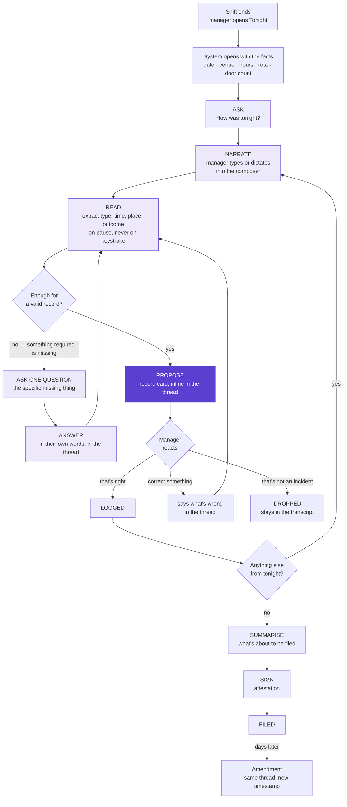
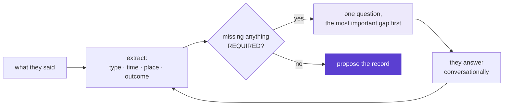
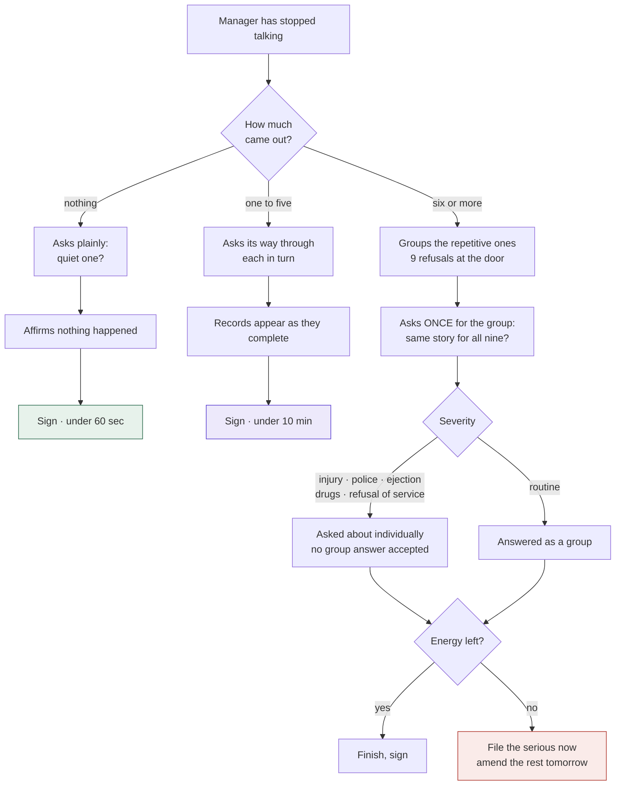
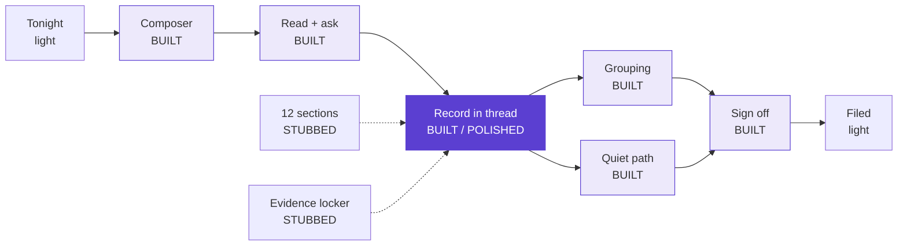

# End-of-shift flow

The whole closing flow, mapped. One road on it gets built — the incident path,
marked **BUILT** throughout.

Structural, not pretty: this is the map, not the deliverable. The brief asks for
this redrawn by hand — see [redrawing this](#redrawing-this-by-hand) at the end.

---

## Two moments, two flows

The manager meets this product twice a night, and the two visits want
opposite things.

| | **Quick log** — 01:42, on the floor | **Shift report** — 03:40, back office |
|---|---|---|
| Entry | Dashboard → *Log an incident* | Dashboard → *Add report* |
| Costs them | **One exchange.** Zero questions if it can read a place | A few short answers |
| Time | **Now** — never asked | Already known |
| CCTV | Camera and window flagged **automatically** | Already flagged |
| Asks about | Nothing else | The details deferred at 01:42 |
| Ends at | Back to the floor | Attestation and signature |

The split exists because the footage is the perishable part. A flag raised at
01:42 catches footage that is minutes old; the same flag at 03:40 is chasing
something a venue recorder may already have overwritten.

**Nothing is ever narrated twice.** The report flow opens holding what was
logged as it happened, and picks up only what was deferred. The record improves
across the night rather than demanding everything at the worst possible moment.

---

## The one decision everything else follows from

**There is no form. There is a conversation.**

The manager never sees an empty field. When the system needs something it
doesn't have, it *asks* — one specific question, in the thread, in the same
place they're already typing. The structured record is generated out of the
back of that conversation, not typed into the front of it.

This is the difference between an AI-assisted product and a form with a robot
bolted on. Every other tool in the category makes the manager fill the gaps.
Ours notices the gaps and asks about them.

```
  Form-shaped (what we are NOT building)     AI-native (what we are)
  ────────────────────────────────────       ──────────────────────────
  Here are 9 fields. Fill them.              How was tonight?
  → manager types into boxes                 → manager talks
  → system stores what was typed             → system reads, asks what's missing
  → gaps stay gaps                           → manager answers in their own words
                                             → system writes the record
```

---

## The spine



Violet is **BUILT**. The dark node — the proposed record appearing inline — is
the polished moment.

---

## 1. Entry — it speaks first

No blank page, no create step, no "new report" button. The report exists
because the shift exists. The system opens the conversation holding everything
it already knows:

> **Sat 12 Sep · The Vault · 21:00–04:00 · 387 through the door**
> Marek, Ana, Tomas on the door. Priya and Danny behind the bar.
> How was tonight?

**The first act of AI heavy lifting is not writing. It's arriving with the
facts already in hand**, so nothing already known ever gets typed.

---

## 2. Narrate — one composer, bottom of the screen

Where a chat composer lives, because that is the affordance everyone already
understands for "say something and get a response."

- **Type** — primary. A laptop in a back office after close.
- **Dictate** — live, and the faster path. They've already told this story to
  three people tonight.
- **Drop files** — straight into the thread, as a message.

No mode switch between "guided" and "freeform". The manager who wants
scaffolding gets it as the questions that come back. The manager who wants to
dump gets to dump. Same composer, same thread, different felt experience.

---

## 3. Read, then ask — the loop that replaces the form



### Rules the asking obeys

1. **One question at a time.** A list of six questions is a form wearing a
   speech bubble. Ask the most consequential gap, take the answer, re-read,
   ask again if still short.
2. **Only ever ask for what's required and missing.** Never confirm something
   it already read correctly — that's the manager doing QA on the machine.
3. **Ask in the manager's register, not the register's register.** "What time
   did that kick off?" not "Please supply occurredAt."
4. **A blank beats a guess — still.** If they say "no idea", it records *no
   idea* and moves on. It never invents a timestamp for a document an insurer
   may read.
5. **It asks whether names were taken. It never proposes one.** The system
   classifies events, never people. "Did you get names?" is a question. "Was it
   the man from last week?" never is.
6. **Every question is answerable in four words.** If it can't be, it's the
   wrong question.

### What that sounds like

> **Manager:** two guys got into it in the smoking area about half one, door
> team pulled them both out
>
> **System:** Ejection, smoking area, around 01:40. Two things — was anyone
> hurt, and did you get names or descriptions?
>
> **Manager:** no injuries, no names
>
> **System:** Got it. Want me to flag the smoking area camera for 01:30–01:50?
> It'll overwrite itself otherwise.
>
> **Manager:** yes
>
> **System:** *[record card appears inline]* Logged. Anything else from tonight?

Four exchanges, no fields, a complete statutory entry.

---

## 4. Propose — the record appears in the thread

When it has the four required fields, it shows the record it wrote, **inline,
as a card in the conversation**. Not in a side panel, not on another screen.

The manager reacts to it the way they'd react to anything else in a chat:

| They say | What happens |
|---|---|
| nothing / "yep" | Logged |
| "it was bar 2 not bar 1" | Corrects that field, keeps the rest, shows the change |
| "that's two separate things" | Splits into two records |
| "that's not worth logging" | Dropped — and stays in the transcript |
| "where did you get that?" | Shows the sentence it came from |

**Correction is conversation, not editing.** No click-into-field, no save
button. They say what's wrong; it fixes it and shows them.

---

## 5. How the flow bends

Same spine. What changes is what it does with **silence** and with **volume**.



| | Quiet — 0 | Typical — 1 to 5 | Chaotic — 20+ |
|---|---|---|---|
| **What it does** | Says it found nothing, asks once | Asks its way through | Groups, then asks once per group |
| **What they do** | Affirm the night was clean | Answer short questions | Answer for a group; open the serious ones |
| **Escape hatch** | n/a | n/a | File serious, amend tomorrow |
| **Target** | **< 60 sec** | **< 10 min** | **Serious filed < 10 min** |

### The quiet night is the most important branch

The most common night, and the one every tool treats as "the user didn't show
up." An empty report proves nothing. A report where a named manager
affirmatively recorded that nothing happened **is** evidence — it establishes
the venue was running its process that night.

It's also where the habit is built. The product only works on the chaotic night
if opening it is already reflex.

### The chaotic night needs an exit, not more questions

Nobody answers sixty questions at 3am. The grouping is what makes volume
survivable: nine refusals at the door become **one** question, not nine.

But the severity gate holds — injury, police, ejection, drugs and refusal of
service are never answered as a group. Not a warning message, a structural
refusal, because warnings get clicked through.

---

## 6. The other twelve sections

Named in the shell, all optional, none of them a form either. If the manager
mentions the bar being short-staffed, that lands against **Bar staff review**
without anyone choosing a section. Silence on a section is silence — no
progress bar, no nagging.

**No completion meter across the thirteen.** That's guilt with a UI, and it
trains people to pad sections to clear the bar. The only completeness measured
is per incident: does this one carry what someone will ask for later.

---

## 7. Where the ten minutes go

| Step | Cost | How it's kept down |
|---|---|---|
| Entry | ~0 sec | It opens holding the facts. Nothing known gets typed. |
| Narrate | 2–4 min | One composer. Dictation. No field-hunting. |
| Read | 0 sec of their time | Happens while they're still typing. |
| Answer back | 3–5 min | Four-word answers to specific questions. |
| Sections | 0 min | Extracted from what they already said. |
| Sign | ~20 sec | One summary, one signature. |

**Three friction killers:** arrive with the facts · one place to talk ·
answer questions instead of filling fields.

---

## 8. What gets built



The polished moment is **the record appearing in the thread** — the instant it
hands back what it thinks happened and a tired human decides whether to trust
it.

---

## Redrawing this by hand

The brief wants this unpolished, ~1 hour, FigJam or paper. The logic is
settled, so the redraw is mechanical. What to emphasise:

**Draw the ask-loop as an actual loop.** Narrate → read → ask → answer → read
again. It should visibly circle. That loop *is* the product; if it's drawn as a
straight line it looks like a form with extra steps.

**Put the composer at the bottom of every screen you draw.** It's the one
constant. The thread grows above it.

**Show the record card appearing inside the thread**, not off to the side. The
whole architecture argument is that the output lands where the conversation is.

**Mark the two tensions on the map itself.** At the composer: *"guided and
freeform converge here — no mode choice."* At the ask-loop: *"guidance is the
questions, not the fields."*

**Put the time targets on the branches**, not in a legend.

**Leave the mess in.** Crossings-out, a question mark by door-staff
reconciliation, an arrow you redrew. A suspiciously tidy sketch reads as output
rather than thinking.

### Worth annotating as open

- Does the door team file separately, and who owns the reconciled account?
- Is there a filing deadline in the target jurisdictions? If yes, the amendment
  path needs a visible clock.
- Does a Martyn's Law Designated Senior Individual counter-sign? That's a
  second approval state hanging off sign-off.
